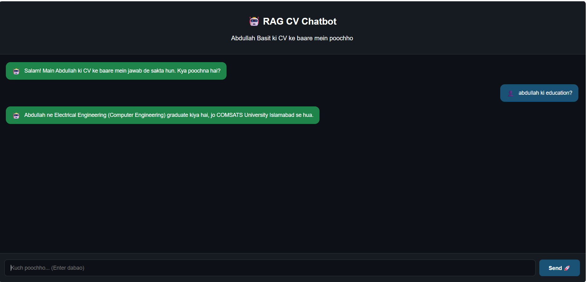

# ⚛️ RAG PDF Chatbot — React Frontend

Modern React chat interface for the RAG PDF Chatbot backend.

## 🛠️ Tech Stack
- **React.js** — Frontend framework
- **Fetch API** — Backend communication
- **CSS-in-JS** — Inline styling

## ✨ Features
- 💬 Real-time chat interface
- 🤖 AI-powered responses
- 📱 Responsive design
- ⏳ Loading indicator
- ⌨️ Enter key support

## 🚀 How to Run

```bash
# Install dependencies
npm install

# Start development server
npm start
```

App will run on `http://localhost:3000`

## ⚙️ Configuration

Make sure backend is running on `http://127.0.0.1:8000`

Backend repo: [rag-pdf-chatbot](https://github.com/abdu2256/rag-pdf-chatbot)

## 📸 Screenshots


## 🔗 Related
- 🔙